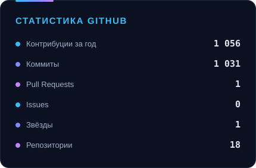
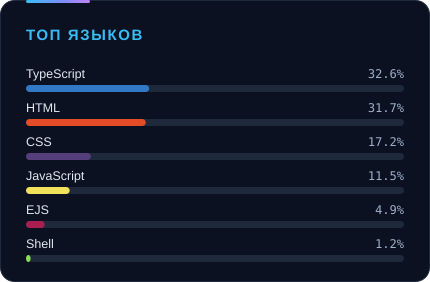
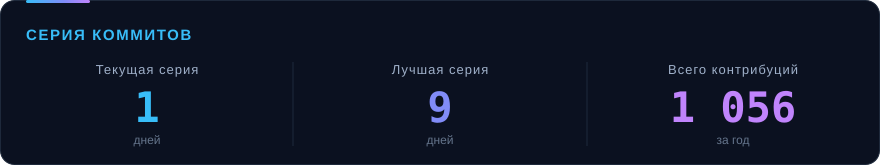
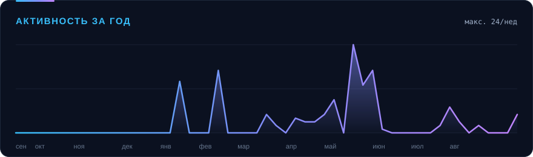

  

   
  
  
  

 

## Обо мне

Fullstack-разработчик. Делаю веб-приложения на React и Next.js с TypeScript, бэкенды на .NET и Node.js, и Telegram-ботов, которые работают круглосуточно без присмотра. Пишу так, чтобы через полгода самому было понятно, что здесь происходит.

- 🎯 **Фокус:** строгая типизация, чистая вёрстка, предсказуемые состояния загрузки и ошибок
- 🤖 **Боты:** Telegram.Bot на C#, aiogram на Python — парсеры, автопостинг, уведомления, накрутка активности
- 🏗 **.NET:** ASP.NET Core, Clean Architecture, Dapper и EF Core, PostgreSQL, Redis, JWT-авторизация
- 🕷 **Парсинг:** обход сайтов с ротацией прокси, выгрузка результатов в Excel и в базу
- ⚙️ **Подход:** сначала прототип, потом рефакторинг — но без долгов в виде «потом починю»
- 📦 **Инфраструктура:** Docker и docker-compose, автодеплой, логи, по которым видно, что упало

---

## Стек

**Языки**

**Frontend**

**.NET и backend**

**Базы данных**

**Боты и автоматизация**

**Инфраструктура**

---

## Избранные проекты

| Проект | Стек | Что это | Демо |
| :--- | :--- | :--- | :---: |
| **[karaoke-bar](https://github.com/rasuliyonn/karaoke-bar)** | React 19 · TypeScript · Vite · Tailwind | Сайт караоке-бара: меню, залы, бронирование | — |
| **[MaxDev](https://github.com/rasuliyonn/MaxDev)** | Next.js · TypeScript · Prisma | Фуллстек-приложение с базой данных и серверной логикой | — |
| **[vash-podyomnik-site](https://github.com/rasuliyonn/vash-podyomnik-site)** | TypeScript | Корпоративный сайт: каталог оборудования и заявки | — |
| **[max-shop](https://github.com/rasuliyonn/max-shop)** | JavaScript | Интернет-магазин: каталог, корзина, оформление заказа | [↗](https://max-shop-nine.vercel.app) |
| **[deki](https://github.com/rasuliyonn/deki)** | CSS · HTML | Продающая посадочная страница | [↗](https://deki-three.vercel.app) |
| **[led-key](https://github.com/rasuliyonn/led-key)** | EJS · Node.js | Сайт услуг с серверным рендерингом | [↗](https://led-key.vercel.app) |

<b>Ещё проекты</b>

 

| Проект | Стек | Что это | Демо |
| :--- | :--- | :--- | :---: |
| **[ege](https://github.com/rasuliyonn/ege)** | HTML | Учебный лендинг для подготовки к ЕГЭ | [↗](https://ege-seven.vercel.app) |
| **[CBJ-Detail](https://github.com/rasuliyonn/CBJ-Detail)** | CSS · HTML | Сайт-визитка с политикой конфиденциальности | — |
| **[nike-jordan](https://github.com/rasuliyonn/nike-jordan)** | CSS · HTML | Адаптивная вёрстка интернет-магазина | — |
| **[T-Pass](https://github.com/rasuliyonn/T-Pass)** | HTML · JavaScript | Лендинг с интерактивной формой | — |
| **[Blanko](https://github.com/rasuliyonn/Blanko)** | HTML · CSS | Многостраничная вёрстка | — |
| **[Todo-list](https://github.com/rasuliyonn/Todo-list)** | TypeScript · Vite | Список задач с хранением состояния | — |
| **[FastAPI-Auth](https://github.com/rasuliyonn/FastAPI-Auth)** | Python · FastAPI | Аутентификация на FastAPI | — |
| **[PasswordGenerator](https://github.com/rasuliyonn/PasswordGenerator)** | Python | Генератор надёжных паролей | — |

---

## Закрытые проекты

Основная работа — в приватных репозиториях, ссылок нет. Коротко о том, что внутри:

| Проект | Стек | Что это |
| :--- | :--- | :--- |
| **Сервис карпулинга** | ASP.NET Core 8 · Clean Architecture · Dapper · PostgreSQL + PostGIS · Redis · JWT · Docker | Бэкенд платформы попутчиков: поездки, заявки, чат, авторизация, миграции. Плюс iOS-клиент на Swift + Capacitor |
| **Парсер площадки → Telegram-бот** | .NET 10 · Telegram.Bot · EF Core + SQLite · HtmlAgilityPack · ClosedXML · Serilog | Обходит сайт через пул прокси, ведёт базу найденного, шлёт уведомления в Telegram и выгружает отчёты в Excel |
| **Telegram-бот с очередью задач** | .NET 10 · Telegram.Bot · SQLite · Docker | Воркеры, разгадывание капчи, самопроверки, конфиг без перезапуска, логирование в файл |
| **Платформа попутчиков POPUTI.TJ** | TypeScript · Node.js | Веб-приложение и API: поездки, бронирование, админка |

---

## Статистика

  
  

  

  

  

Графики генерируются автоматически каждую ночь — без сторонних сервисов.

---

## Контакты

 

<i>Открыт к интересным проектам и сотрудничеству — пишите.</i>

